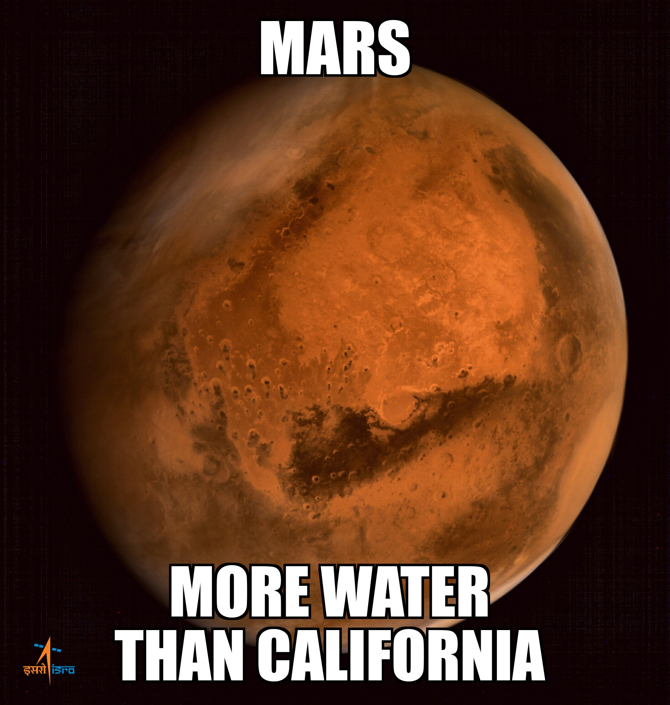

# Mars_News

## Preview

In this assignment, I built a web application that scrapes various websites for data related to the Mission to Mars and displays the information in a single HTML page. The following outlines what you need to do.

## Skills Used

* HTML
* Python
* Web Parsing via Python
* Connection to a non relational database via MongoDB

